# 🎹 Gesture Rhythm Master - Piano Mode

一个基于 **MediaPipe Hands** 的实时手势识别钢琴节奏游戏。玩家无需任何实体键盘——只需在摄像头前用**双手十指**对准屏幕上下落的音符，在正确的时机**弯曲对应手指**即可"弹奏"；在菜单中**移动手掌**控制光标、**握拳**完成点击。

> 使用 88 键真实钢琴采样（`Piano/` 目录）进行声音合成，并支持升/降号映射。


---

## ✨ 特性

- 🖐️ **纯视觉手势操控**：双手 10 指分别对应 10 条轨道，零接触游玩。
- 🎯 **三种手势语义**：光标移动（手部中心）、菜单点击（握拳）、音符命中（手指弯曲 / 点击）。
- 🎵 **真实钢琴音色**：88 个 `tone(N).wav` 单声道采样，按音名动态加载与音高映射。
- 📝 **音符自带音名**：每个下落音符上直接标注真实音名（如 `C#5`、`G#4`），升降号音也能正确显示与发声。
- 📈 **四级节奏判定**：PERFECT / GREAT / GOOD / MISS 独立计数，含连击（combo）与准确率统计。
- 🎚️ **三档难度**：Easy / Normal / Hard 对应不同音符下落速度。
- 🎬 **七首内置曲谱**：小星星、生日歌、铃儿响叮当、送别、欢乐颂、月光奏鸣曲、夜钢琴曲 5 号。
- 🖥️ **全屏 + 摄像头**：全屏游戏、侧边栏右下角为实时摄像头预览（含手部骨架叠加）。
- 🤖 **演示模式**：无手势时自动演奏，演示结束有独立的 "Demo Complete!" 结算界面。
- 🎨 **流畅 UI 动效**：菜单按钮快速淡入、标题发光纹理、音符发光脉冲与轨迹光效。

---

## 🔧 硬件配置

本项目在 **Raspberry Pi 5** 上验证通过，但架构也适用于任意带摄像头的 Linux/macOS/Windows 机器。

| 部件 | 说明 |
| --- | --- |
| 主机 | Raspberry Pi 5（4GB 内存，32GB SD 卡），运行 **Ubuntu 24.04 (arm64)** |
| 摄像头 | Raspberry Pi Camera Module 3（CSI 接口），由 `rpicam-vid`(libcamera) 输出 MJPEG 流 |
| 显示 | 1920×1200 HDMI 显示器 |
| 音频 | USB 音响，`pygame.mixer` 播放采样 |
| 键盘 | USB 键盘，仅用于 `ESC` 退出、`SPACE` 暂停、`Q` 退出 |

### 摄像头数据流（命名管道）

游戏**不**直接调用 `cv2.VideoCapture(0)`，而是由 `CameraManager` 启动 `rpicam-vid` 把 MJPEG 流写入一个命名管道 `/tmp/camera_pipe`，再由 OpenCV 以 `CAP_FFMPEG` 读取。这样可绕开树莓派上 `libcamera` 与 OpenCV 直接采集的兼容问题：

```python
class CameraManager:
    def __init__(self, fps=60):
        ...
        self.pipe_path = '/tmp/camera_pipe'
        ...
        os.mkfifo(self.pipe_path)
        cmd = [
            'rpicam-vid',
            '-t', '0',
            '--width', '320',
            '--height', '240',
            '--framerate', str(fps),
            '--codec', 'mjpeg',
            '--nopreview',
            '--output', self.pipe_path
        ]
```

**摄像头采集规格**：`rpicam-vid` 以 **320×240** 分辨率、默认 **60 FPS**（MJPEG）采集，写入命名管道；OpenCV 以 `CAP_FFMPEG` 读取后镜像，再缩放为 **280×210** 的预览窗口绘制到界面右下角。实际可达帧率取决于 Pi 5 的负载（手势推理 + 渲染），程序会在预览窗口角落实时显示当前 `camera_fps`。

> 若使用普通 USB/内置摄像头，可将 `CameraManager` 改为 `cv2.VideoCapture(0)`（并删除 `rpicam-vid` 相关逻辑），其余手势流水线完全复用。

### 目标帧率

游戏的标准**目标帧率为 60 FPS**（`TARGET_FPS = 60`），由"计算式精确限帧（`time.sleep` 补齐每帧余量） + `pygame.clock.tick` 兜底"双重机制维持。实际帧率取决于主机负载（MediaPipe 手势推理 + Pygame 渲染）。

---

## 🚀 如何运行

### 1. 安装依赖

**系统层**（Ubuntu 24.04 arm64）：

```bash
sudo apt update
sudo apt install -y python3 python3-pip rpicam-apps   # rpicam-apps 提供 rpicam-vid
```

**Python 依赖**（见 `requirements.txt`）：

```bash
pip3 install -r requirements.txt
```

| 依赖 | 用途 |
| --- | --- |
| `opencv-python` | 摄像头帧读取、BGR↔RGB 转换、镜像、绘制关键点 |
| `mediapipe` | `solutions.hands` 提供 21 点手部关键点模型 |
| `pygame` | 游戏渲染、事件循环、音频混音 |
| `numpy` | 坐标计算与数值处理 |

> 程序会设置 `MEDIAPIPE_DISABLE_GPU=1` 与 `TF_CPP_MIN_LOG_LEVEL=3`，强制 MediaPipe 在 **CPU** 上运行并抑制日志，适合树莓派等无独显环境。

### 2. 准备钢琴采样

```bash
mkdir -p ~/Piano
cp -r Piano/* ~/Piano/        # 程序默认从 ~/Piano 读取 tone(N).wav
```

### 3. 运行

**方式 A：树莓派（CSI 摄像头 + rpicam-vid）**

```bash
# 确保摄像头已连接并在 raspi-config 中启用
python3 game.py
```

**方式 B：普通电脑（USB/内置摄像头）**

将 `game.py` 中的 `CameraManager` 改为使用 `cv2.VideoCapture(0)`，并将采样放入 `~/Piano`，其余步骤相同：

```python
# 替换 CameraManager 的初始化逻辑为：
self.cap = cv2.VideoCapture(0, cv2.CAP_ANY)
```

> ⚠️ **未经验证**：方式 B 仅为兼容普通摄像头的参考改法，项目未在非树莓派环境（CSI 摄像头 + rpicam-vid）下实测，手势流水线是否完全可用取决于具体摄像头与驱动，请自行验证。

### 4. 运行中的操作

| 操作 | 手势 / 按键 |
| --- | --- |
| 移动菜单光标 | 手掌左右/上下移动 |
| 确认 / 点击 | 握拳（保持约 3 帧） |
| 弹奏音符 | 音符到判定线时弯曲对应手指 |
| 暂停 | `SPACE`（游戏内） |
| 自动暂停 | 非演示模式下若连续多帧未检测到手，自动暂停并提示 |
| 退出当前界面 | `ESC` |
| 退出程序 | `Q` |

---

## 🤚 手势识别实现（核心）

这是本项目的重点。整套识别链路如下图所示：

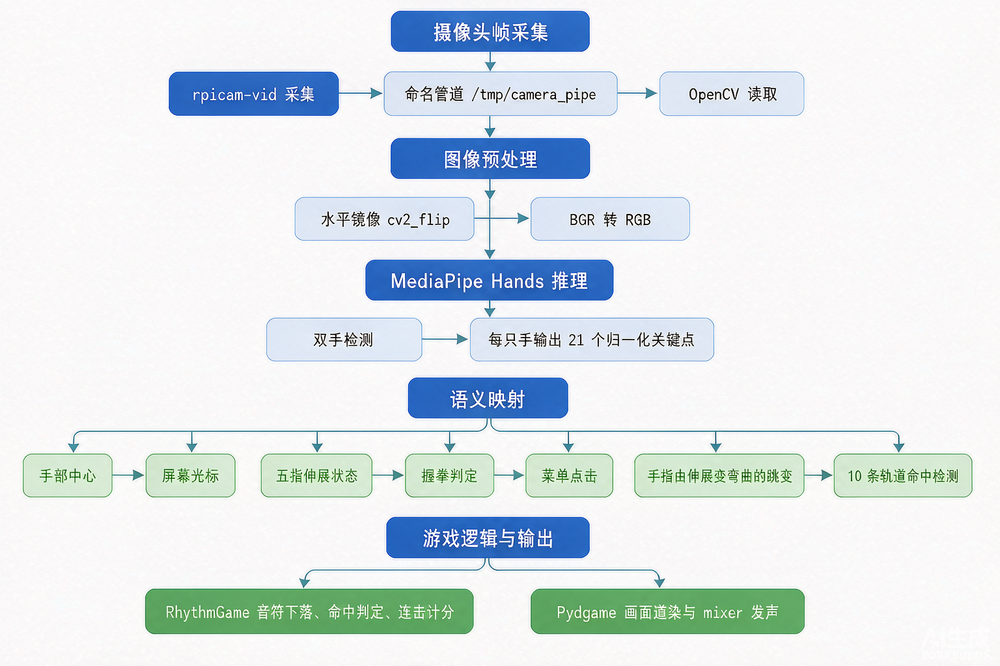

概括为：

```
摄像头帧 ──► [镜像 flip] ──► [BGR→RGB]
        ──► MediaPipe Hands ──► 21 关键点 (归一化 0~1)
        ──► ① 手部中心 → 屏幕光标
        ──► ② 每指伸展状态 → 握拳判定 → 菜单点击
        ──► ③ 手指"伸展→弯曲"跳变 → 对应轨道音符命中
```

### 1. 手部关键点检测（MediaPipe Hands）

初始化一个可检测**双手**的轻量模型（`model_complexity=0` 保证树莓派上的实时性）：

```python
hands = mp_hands.Hands(
    static_image_mode=False,
    max_num_hands=2,
    model_complexity=0,
    min_detection_confidence=0.5,
    min_tracking_confidence=0.3
)
```

在游戏主循环中，每帧把镜像后的 RGB 帧送入模型，得到每只手的 21 个归一化关键点 `hand_landmarks` 与左右手标签 `handedness`：

```python
if frame is not None and camera_available:
    frame = cv2.flip(frame, 1)
    camera_fps = camera.get_fps()
    rgb_frame = cv2.cvtColor(frame, cv2.COLOR_BGR2RGB)
    results = hands.process(rgb_frame)

    if results.multi_hand_landmarks:
        hand_detected = True
        hand_count = len(results.multi_hand_landmarks)
        for idx, (hand_landmarks, handedness) in enumerate(
                zip(results.multi_hand_landmarks, results.multi_handedness)):
            is_left = handedness.classification[0].label == 'Left'
            finger_states = get_finger_states(hand_landmarks, is_left)
```

关键点索引约定（MediaPipe Hands）：

- `0` 手腕；`1/5/9/13/17` 五指掌指关节（MCP）；`2/6/10/14/18` PIP（近端指间关节）；`3/7/11/15/19` DIP（远端指间关节）；`4/8/12/16/20` 指尖。
- 拇指用 `3`（IP 指间关节）↔`4`（指尖）的 **x** 方向判断；其余手指用指尖与 PIP（点 `6/10/14/18`）的 **y** 方向判断。

### 2. 镜像与坐标归一化

摄像头帧先做水平镜像 `cv2.flip(frame, 1)`，形成"照镜子"的自然交互；MediaPipe 输出的关键点坐标为相对图像的归一化值 `[0,1]`，后续用于光标与手势判定时再按屏幕分辨率放大。

### 3. 手势 ①：手部中心 → 屏幕光标

取手掌区域的 5 个参考点（手腕 + 四个 MCP）求平均，作为"手部中心"：

```python
def get_hand_center(hand_landmarks):
    lm = hand_landmarks.landmark
    x = (lm[0].x + lm[5].x + lm[9].x + lm[13].x + lm[17].x) / 5
    y = (lm[0].y + lm[5].y + lm[9].y + lm[13].y + lm[17].y) / 5
    return x, y
```

将中心相对屏幕中心的偏移量归一化到 `[-1,1]`，再乘以灵敏度系数 `MOUSE_SCALE=5.0` 映射到全屏坐标，并做**指数平滑**（平滑系数 0.55，兼顾跟手速度与抗抖动）：

```python
if idx == 0:
    hx, hy = get_hand_center(hand_landmarks)
    center_x = 0.5; center_y = 0.5
    offset_x = (hx - center_x) * 2   # [-1, 1]
    offset_y = (hy - center_y) * 2
    screen_x = SCREEN_WIDTH // 2 + offset_x * SCREEN_WIDTH * MOUSE_SCALE / 2
    screen_y = SCREEN_HEIGHT // 2 + offset_y * SCREEN_HEIGHT * MOUSE_SCALE / 2
    screen_x = max(margin, min(SCREEN_WIDTH - margin, screen_x))
    screen_y = max(margin, min(SCREEN_HEIGHT - margin, screen_y))
    mouse_x = mouse_x * (1 - 0.55) + screen_x * 0.55   # 低通平滑
    mouse_y = mouse_y * (1 - 0.55) + screen_y * 0.55
```

> `MOUSE_SCALE=5.0` 意味着手掌只需在画面内移动约 **1/5** 范围即可横扫整屏，适合站立远距离游玩；可按手感下调。

#### 单手优先：仅第一只手控制光标

主循环用 `enumerate(...)` 遍历检测到的双手，但**只有索引 `idx == 0` 的那只手**参与光标映射与握拳判定：

```python
if idx == 0:
    hx, hy = get_hand_center(hand_landmarks)
    ...
    mouse_x = mouse_x * (1 - 0.55) + screen_x * 0.55   # 低通平滑
    mouse_y = mouse_y * (1 - 0.55) + screen_y * 0.55

    if is_fist(finger_states, is_left):
        fist_timer += 1
        if fist_timer >= FIST_THRESHOLD:
            is_fisting = True
    else:
        fist_timer = 0
        is_fisting = False
```

也就是说：

- 第一只被 MediaPipe 检出的手 → 驱动**屏幕光标移动** + 触发**握拳点击**；
- 第二只手（若存在）→ 仅提供 `finger_states` 用于**音符弹奏**，不影响光标。

这样设计的好处是：游玩时一只手悬停在菜单附近也不会"抢走"光标，另一只手可专心弹奏；代价是光标始终跟随先被检测到的那只手，若换手顺序变化可能出现光标短暂跳变。

#### 光标状态机（`Cursor` 类）

主循环每帧把 `(mouse_x, mouse_y, is_fisting)` 喂给 `Cursor.update()`，`Cursor` 在此基础上维护一套**点击状态机**，与第 5 节的"握拳迟滞"配合实现稳定点击：

| 字段 | 含义 |
| --- | --- |
| `click_hold_frames` | 当前连续握拳帧数，越界到 `CLICK_HOLD_THRESHOLD=10` 时判定为一次有效点击 |
| `click_progress` | `click_hold_frames / CLICK_HOLD_THRESHOLD`，取值 `[0,1]`，用于绘制**环形倒计时进度条** |
| `click_available` | 握拳满 10 帧后置 `True`，表示"可点击"；菜单系统通过 `is_click_active()` 读取 |
| `click_triggered` | 该次点击是否已被菜单消费（`consume_click()` 置位），**保证一次握拳只触发一次点击** |
| `reset_timer = 8` | 触发点击后进入 8 帧冷却，期间绘制**发光脉冲**反馈，随后复位 |

状态流转（见 `game.py` `Cursor.update`）：

```
握拳开始 → click_hold_frames 累加、click_progress 递增（画面画环形进度）
   └─ 满 10 帧 → click_available = True、进入 8 帧 reset_timer（发光脉冲）
        └─ 菜单 is_click_active() 命中 → consume_click() 消费，click_triggered=True
松拳   → click_progress 每帧衰减 0.03，恢复初始
```

绘制表现（`Cursor.draw`）：

- **悬停 / 握拳中**：以光标为圆心画出随 `click_progress` 增长的白色**环形进度条**，直观提示"还需保持握拳多久才会点击"。
- **点击触发瞬间**：在光标中心叠加一圈白色**发光脉冲**，作为确认反馈。

#### 光标可见性规则

光标并非全程可见，按界面状态切换（`cursor.set_visible()`）：

| 界面 | 光标可见？ | 原因 |
| --- | --- | --- |
| 开始 / 选曲 / 难度菜单 | ✅ 显示 | 需用手掌移动光标、握拳点选 |
| 暂停菜单 | ✅ 显示 | 需在菜单内点选"继续/退出" |
| 结算界面 | ✅ 显示 | 需点选"重玩/返回菜单" |
| 游戏内（演奏中） | ❌ 隐藏 | 此阶段用"弯曲手指"弹奏，无需光标，隐藏可避免遮挡轨道 |

因此：进入演奏（`start_game` / `demo`）时 `cursor.set_visible(False)`，回到任意菜单时 `cursor.set_visible(True)`。

### 4. 每根手指的伸展状态

`get_finger_states` 用几何阈值给出每根手指是否"伸展"（布尔值）。由于做了镜像，判定时需注意左右手的 x 方向符号相反：

```python
def get_finger_states(hand_landmarks, is_left_hand):
    lm = hand_landmarks.landmark
    ...
    if is_left_hand:
        finger_states['left_thumb']  = lm[4].x  > lm[3].x
        finger_states['left_index']  = lm[8].y  < lm[6].y
        finger_states['left_middle'] = lm[12].y < lm[10].y
        finger_states['left_ring']   = lm[16].y < lm[14].y
        finger_states['left_pinky']  = lm[20].y < lm[18].y
    else:
        finger_states['right_thumb']  = lm[4].x  < lm[3].x
        finger_states['right_index']  = lm[8].y  < lm[6].y
        finger_states['right_middle'] = lm[12].y < lm[10].y
        finger_states['right_ring']   = lm[16].y < lm[14].y
        finger_states['right_pinky']  = lm[20].y < lm[18].y
```

#### 用到的关节与判断依据

MediaPipe Hands 给每根手指标了 4 个关键点（拇指 3 个），由根到尖排列。本项目判断"是否伸展"时，用**指尖**与**中间关节**做比较：

| 手指 | 指尖（TIP） | 比较的中段关节 | 比较方向 | 含义 |
| --- | --- | --- | --- | --- |
| 食指 | `8` | `6`（**PIP** 近端指间关节） | y | 指尖在 PIP 上方（y 更小）＝伸展 |
| 中指 | `12` | `10`（**PIP**） | y | 同上 |
| 无名指 | `16` | `14`（**PIP**） | y | 同上 |
| 小指 | `20` | `18`（**PIP**） | y | 同上 |
| 拇指 | `4`（TIP） | `3`（**IP** 指间关节，拇指无 PIP） | x | 见下 |


*Image Source: Mediapipe Documentation*

- **PIP（Proximal Interphalangeal Joint，近端指间关节）**：四指的中间关节（点 `6/10/14/18`）。因为手指正常的屈伸发生在 y 方向（图像坐标系 y 轴向下），所以"向上伸"时指尖 y 小于 PIP 的 y，以此判定伸展；弯曲（按下）时指尖 y 大于 PIP 的 y。
- **拇指特殊**：拇指是侧向开合的，没有 PIP，只有 **IP（Interphalangeal，指间关节，点 `3`）**。因此拇指不用 y、而用 **x 方向**比较指尖 `4` 与 IP `3`：做镜像后，左手 `lm[4].x > lm[3].x`、右手 `lm[4].x < lm[3].x` 表示拇指张开（伸展）。

> 注：第 1 节关键点索引约定中，`2/6/10/14/18` 为 PIP，`3/7/11/15/19` 实为 **DIP（远端指间关节）** 而非 PIP→DIP；本游戏只用到了 PIP（`6/10/14/18`）判断四指伸展、用 IP（`3`）判断拇指，并未使用 DIP。

要点：非拇指手指"向上伸"时指尖 `y` 小于 PIP 的 `y`（图像坐标系 y 轴向下）；拇指用左右向 `x` 判断开合。

### 5. 手势 ②：握拳 → 菜单点击（带迟滞去抖）

当一只手中**伸展的手指数 ≤ 1** 时判定为"握拳"，用作点击：

```python
def is_fist(finger_states, is_left):
    if is_left:
        fingers = ['left_thumb', 'left_index', 'left_middle', 'left_ring', 'left_pinky']
    else:
        fingers = ['right_thumb', 'right_index', 'right_middle', 'right_ring', 'right_pinky']
    extended_count = sum(1 for f in fingers if finger_states.get(f, False))
    return extended_count <= 1
```

为避免单帧抖动导致误触，主循环对握拳做了**迟滞（hysteresis）**：连续 ≥ `FIST_THRESHOLD=3` 帧都判定为握拳才置位 `is_fisting`，一旦张开立即清零：

```python
if is_fist(finger_states, is_left):
    fist_timer += 1
    if fist_timer >= FIST_THRESHOLD:
        is_fisting = True
else:
    fist_timer = 0
    is_fisting = False
```

随后交给 `Cursor` 对象，并叠加 **8 帧点击冷却**（`is_click_active()`），鼠标移动与点击状态被送入菜单系统完成"悬停+点选"。

### 6. 手势 ③：手指弯曲 → 音符命中

游戏有 **10 条轨道**，每条轨道固定对应一根手指（左右手各 5 指）。映射表如下（左侧 1–5、右侧 6–10）：

```python
FINGER_MAP = {
    'left_pinky': 1, 'left_ring': 2, 'left_middle': 3,
    'left_index': 4, 'left_thumb': 5,
    'right_thumb': 6, 'right_index': 7,
    'right_middle': 8, 'right_ring': 9, 'right_pinky': 10
}
```

"弹奏"动作被建模为**手指由伸展变为弯曲的跳变**（一次"点击"）。每帧对比当前与上一帧的伸展状态，凡是"上一帧伸、这一帧弯"的手指即视为被按下，转换为对应的轨道编号：

```python
pressed_fingers = []
if finger_states is not None:
    for finger_name, is_extended in finger_states.items():
        prev_state = self.prev_finger_states.get(finger_name, False)
        if prev_state and not is_extended:
            pressed_fingers.append(finger_name)
    self.prev_finger_states = finger_states.copy()

pressed_numbers = []
for finger_name in pressed_fingers:
    if finger_name in FINGER_MAP:
        pressed_numbers.append(FINGER_MAP[finger_name])

active_fingers = pressed_numbers
```

> 因此游玩时：**当某个音符滑入屏幕底部的判定线（hit line）时，快速弯曲对应手指**即可触发该音符。连续弯曲同一手指可连击不同音符。

### 7. 命中判定与评级

音符持续下落，当它的**中心**进入判定带 `[hit_line - 35, hit_line + 35]` 且对应轨道手指被按下时，按音符中心与判定线中心的偏差评级：

```python
hit_zone_top = self.hit_line - self.hit_zone_height
hit_zone_bottom = self.hit_line + self.hit_zone_height
hit_center = self.hit_line

zone_height = self.hit_zone_height * 2
PERFECT_THRESHOLD = zone_height * 0.15
GREAT_THRESHOLD = zone_height * 0.35
GOOD_THRESHOLD = zone_height * 0.60

for note in self.notes:
    note.update()
    if not note.hit and not note.miss:
        note_center_y = note.y + note.height / 2
        in_zone = hit_zone_top <= note_center_y <= hit_zone_bottom
        if in_zone and note.lane in active_fingers and self.hit_cooldown == 0:
            distance = abs(note_center_y - hit_center)
            if distance < PERFECT_THRESHOLD:     # 10.5px
                self.score += 100 + self.combo * 5
                ...   # PERFECT!
            elif distance < GREAT_THRESHOLD:     # 24.5px
                self.score += 80 + self.combo * 4
                ...   # GREAT!
            elif distance < GOOD_THRESHOLD:      # 42px
                self.score += 50 + self.combo * 2
                ...   # GOOD
```

判定带高度 `hit_zone_height = 35`（判定线 `hit_line = height - 90` 上下各 35px，共 70px），三级阈值按判定带高度的比例划分：**PERFECT < 15%（10.5px）、GREAT < 35%（24.5px）、GOOD < 60%（42px）**。两次成功命中之间还有 **3 帧冷却**（`hit_cooldown`），防止一次手指抖动吞掉相邻音符。音符越过判定带底部 20px 仍未命中则计 `MISS` 并清空连击。

### 8. 鲁棒性处理小结

- **CPU 推理**：`MEDIAPIPE_DISABLE_GPU=1`，适配无 GPU 设备。
- **指数平滑**：光标坐标低通滤波（系数 0.55），抑制关键点抖动。
- **冷却**：点击后 8 帧冷却 + 命中后 3 帧冷却，杜绝误触。
- **缺手暂停**：非演示模式下若连续多帧未检测到手，自动暂停并提示，避免"幽灵操作"。
- **光标防抖**：`Cursor` 引入 1px 死区（仅当移动超过死区才更新目标坐标），平滑系数 0.55 既加快光标跟手速度，又抑制微小抖动。
- **结果缓存**：`get_finger_states` 对相同关键点做 `FINGER_STATE_CACHE` 缓存，降低重复计算。
- **调试叠加**：检测到手时在预览画面用 `mp_drawing` 画出 21 点骨架，便于校准。

---

## 🎮 游戏逻辑设计

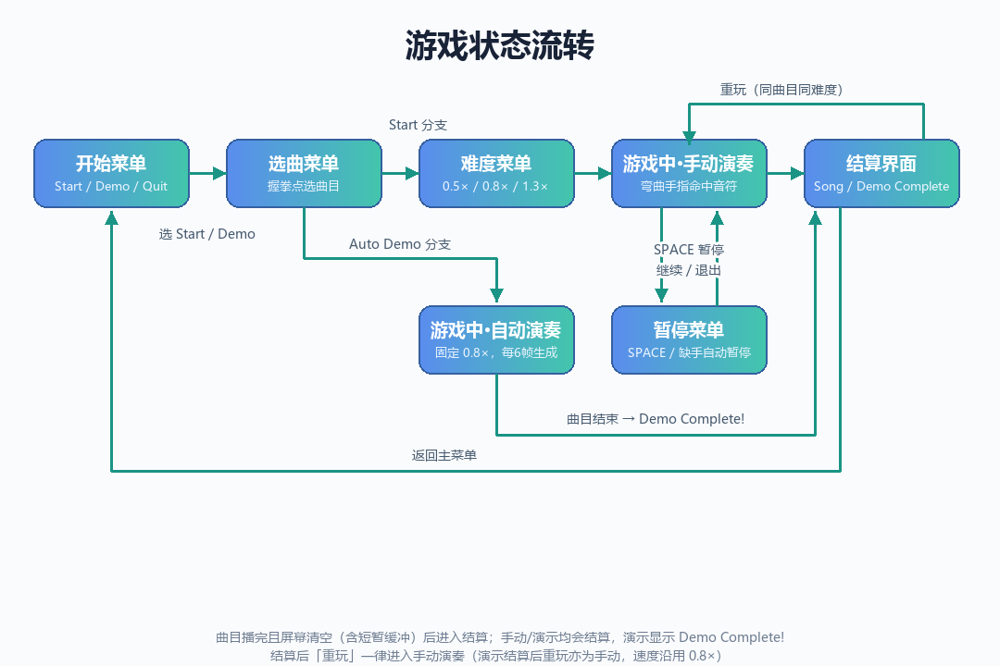

```
开始菜单
  ├─ Start Game ──► 选择曲目 ──► 选择难度 ──► 游戏中（手动演奏）──┐
  └─ Auto Demo  ──► 选择曲目 ───────────────► 游戏中（自动演奏）──┤
                                                                  ▼
                                                              结算界面
                       ┌──────────────────┬──────────────────┐
                       ▼                  ▼                  ▼
              重玩·手动 → 手动演奏   重玩·Demo → 自动演奏   返回主菜单 → 开始菜单
```

- **曲目**：内置 **7 首**——`Twinkle Twinkle Little Star`、`Happy Birthday`、`Jingle Bells`、`Farewell`（送别）、`Ode to Joy`、`Moonlight Sonata`、`Night Piano No.5`。每首在 `PianoSheet.get_song()` 中以 `(简谱数字, 时值)` 序列定义，另配 `scale_notes` 表把简谱翻译成真实音名（如 `'1''→C5`、`'b3'→Eb4`）。
- **音符生成**：按曲谱顺序逐个生成，间隔由该音符时值决定——`spawn_delay = max(1, int(20 × duration / 0.2))` 帧，同屏音符上限 30 个；**演示模式**改为固定每 6 帧生成一个，节奏明显更快。
- **难度**：`Easy=0.5×` / `Normal=0.8×` / `Hard=1.3×`，**只影响音符下落速度**（`speed = 5.5 × (屏高/720) × speed_multiplier`），不改变生成间隔；演示模式固定按 `0.8×` 演奏，跳过难度选择。
- **轨道分配**：每个音符随机落到 1–10 号轨道（`random.randint(1, 10)`），与它弹什么音无关；轨道底部标签固定为 `C4…E5`，而音符上显示的是它自己的真实音名（`actual_note`，如 `C#5`）。全部音符下落完且屏幕清空后，等待一小段缓冲才判定曲目结束并进入结算。
- **音频**：`get_note_sound()` 按音名在 `Piano/` 采样目录中查找对应 `tone(N).wav`，`AudioManager` 用 64 个混音通道保证长音不被截断；暂停或重开时 `stop_all()` 清空所有通道。
- **计分**：`score`（含连击加成）、`combo` / `max_combo`、`perfect/great/good/miss` 计数、`accuracy` 准确率，结算界面展示评级（详见下方「🏆 计分与评级」章节）。
- **控制**：通过光标触发各个菜单中的按键实现控制，演奏曲目时检测不到手自动暂停；必要时可通过键盘控制（见前面的键盘部分说明）。结算界面可「重玩」或「返回主菜单」：**手动演奏**结算后的「重玩」沿用当前曲目与难度回到手动演奏；**自动演示**结算后的「重玩」回到自动演奏（跳过难度选择）；两者均可「返回主菜单」。

## 🔊 音频播放实现（核心）

游戏里每一个钢琴音都来自 88 键真实采样，按「判定命中 → 取采样 → 解码缓存 → 算音量 → 通道播放」的链路实时合成，声音与画面命中特效同源同步触发。完整管线：

```
音符进入判定区（手动 PERFECT/GREAT/GOOD 或 Demo AUTO）
   → get_note_sound(actual_note, duration)
        → get_sample_file_for_note() : 音名 → tone(idx+1).wav
        → load_piano_sample()        : pygame.mixer.Sound 解码 + SAMPLE_SOUND_CACHE 缓存
        → 计算 final_volume（力度 / 时值 / 高音补偿）
        → AudioManager.play_sound()  : 找空闲通道 → channel.play()
                                        → 扬声器
```

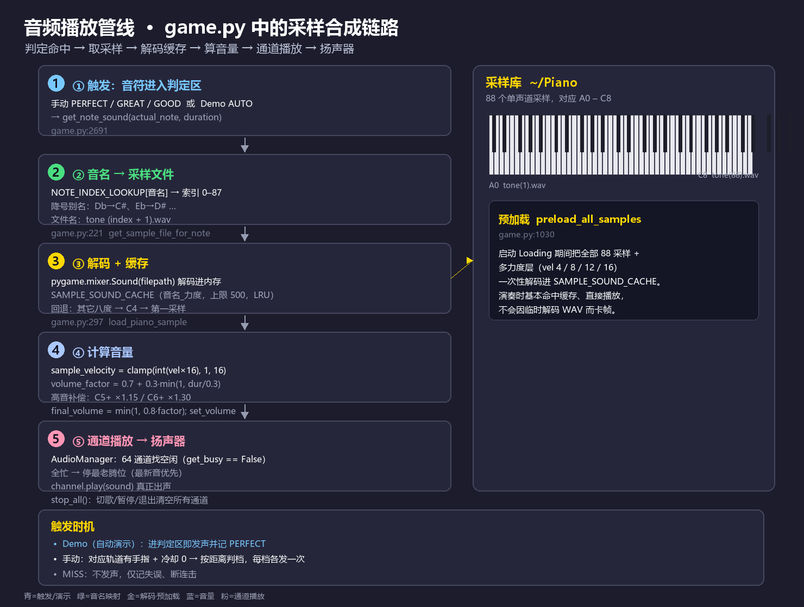

### 1. 音频引擎初始化（game.py:35）

`pygame.mixer.init(frequency=44100, size=-16, channels=1, buffer=1024)`：采样率 44.1kHz、16 位有符号、**单声道**（采样本身单声道，省内存省解码）；缓冲区 1024 帧。`pygame.mixer.set_num_channels(64)` 开 **64 个并发混音通道**，支持同一瞬间最多 64 个音叠加而不互相打断（轮指、和弦、连击时关键）。

### 2. 采样库与音名映射（game.py:83）

`SAMPLES_DIR = ~/Piano`，88 个文件 `tone(1).wav … tone(88).wav` 对应 **A0（最低）到 C8（最高）**。`NOTE_NAMES_88` 列表 + `NOTE_INDEX_LOOKUP` 字典把音名映射到索引 `0–87`，并内置 `Db→C#`、`Eb→D#` 等降号别名；`NOTE_TO_MIDI` / `MIDI_TO_NOTE` 完成音名 ↔ MIDI 编号（A0=21 … C8=108）互转。

### 3. 音名 → 具体文件（game.py:221，`get_sample_file_for_note`）

`NOTE_INDEX_LOOKUP[note]` 取索引；直接查不到时用 `parse_note_name_simple()` 解析（支持简谱 `1' 2'`、升/降号）。文件名 `tone (index + 1).wav`——列表从 0 起、文件从 1 起，故 `+1`；用 `os.path.exists` 确认存在才返回。

### 4. 解码 + 缓存（game.py:297，`load_piano_sample`）

`pygame.mixer.Sound(filepath)` 把 WAV 解码成可播放对象（仅进内存、**不播放**），存入 `SAMPLE_SOUND_CACHE`，键为 `音名_力度`，**上限 500 条**，超限清掉最早一半（LRU 思路），避免内存被撑爆。找不到对应采样时依次回退：同音名其它八度 → `C4` → 第一个采样，保证永远有声音可出。

### 5. 音量计算（game.py:343，`get_note_sound`）

- `sample_velocity = clamp(int(velocity * 16), 1, 16)`：力度分层，对应预加载时的不同力度层采样；
- `volume_factor = 0.7 + 0.3 * min(1.0, duration / 0.3)`：时值越长越响；
- 高音补偿：`C5+` ×1.15、`C6+` ×1.30；
- `final_volume = min(1.0, 0.8 * volume_factor)`，`sound.set_volume()` 只影响**本次播放**，不污染缓存里的原始采样。

### 6. 通道分配与播放（game.py:145，`AudioManager`）

`play_sound()` 加线程锁后：先清掉已播完的通道（`_cleanup_stopped_channels`），再遍历 64 通道找一个 `get_busy() == False` 的空闲通道；全忙则 `stop()` 最老的音腾位置（最新音优先）。`channel.play(sound)` **真正开始出声**，并把 `(音名, 起始时间, sound, 通道)` 登记到 `playing_notes` 以便追踪/抢占。`stop_all()` 在切歌 / 暂停 / 退出 / 重开时停掉所有通道，清掉残留尾音。

### 7. 触发时机（game.py:2691）

音符中心进入判定区且被命中时发声：

- **Demo（自动演示）**：进判定区即 `get_note_sound()` 并记 PERFECT；
- **手动模式**：对应轨道有手指且命中冷却为 0，按距离判 PERFECT / GREAT / GOOD，**每一档各调一次 `get_note_sound`**；
- **MISS**：不发声，仅记失误、断连击。

### 8. 预加载（game.py:1030，`preload_all_samples`）

启动 Loading 期间把全部 88 采样 + 多个力度层（vel 4/8/12/16）解码进缓存，使正式演奏基本命中缓存、直接播放，**不会因临时解码 WAV 而卡帧**。

---

## 🏆 计分与评级

### 1. 命中判定与单次得分

当音符**中心**进入判定带 `[hit_line - 35, hit_line + 35]`（判定线 `hit_line = 屏幕高度 - 90`，判定带上下各 35px）且对应轨道手指被按下时，按**音符中心与判定线的像素距离 `distance`** 评级并结算分数：

| 评级 | 距离阈值 | 基础分 | 连击加成 | 提示色 |
| --- | --- | --- | --- | --- |
| PERFECT! | `distance < 10.5px`（判定带的 15%） | 100 | `+ combo × 5` | 绿 |
| GREAT! | `distance < 24.5px`（判定带的 35%） | 80 | `+ combo × 4` | 青 |
| GOOD | `distance < 42px`（判定带的 60%） | 50 | `+ combo × 2` | 蓝紫 |
| MISS | 音符越过判定带底部 20px 仍未被命中 | 0 | 连击清零 | 红 |

单次得分 = **基础分 + 当前连击数 × 系数**。例如当前连击为 20 时打出 PERFECT，本次得分 = 100 + 20×5 = 200。连击越高，单次收益越高，是冲分的关键。

### 2. 连击（Combo）

- 每成功命中一个音符（含 PERFECT / GREAT / GOOD），`combo` 加 1，并记录本局 `max_combo`（最高连击）。
- 出现 **MISS**（音符漏掉 / 越过判定带）时 `combo` 立即归零。
- 连击数直接参与得分公式的加成项，因此保持长连击能放大总分。

### 3. 准确率（Accuracy）

```text
total_notes  = perfect_count + great_count + good_count + miss_count
accuracy     = (perfect_count + great_count + good_count) / total_notes × 100%
```

PERFECT、GREAT、GOOD 均计入命中，只有 MISS 不计入。

### 4. 结算评级（Rating）

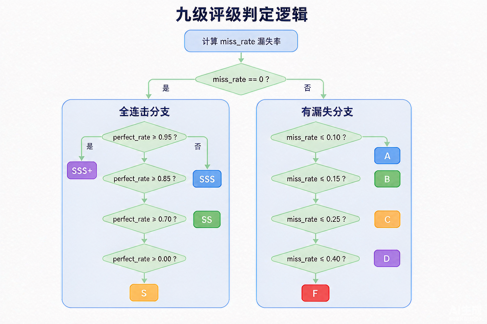

曲目结束（或演示结束）调用 `calculate_rating()`，依据 **漏失率 `miss_rate`** 与 **PERFECT 率 `perfect_rate`** 给出最终评级：

```text
miss_rate    = miss_count    / total_notes
perfect_rate = perfect_count / total_notes
```

| 评级 | 条件 | 含义 |
| --- | --- | --- |
| **SSS+** | `miss_rate == 0` 且 `perfect_rate ≥ 0.95` | Perfect Full Combo! |
| **SSS** | `miss_rate == 0` 且 `perfect_rate ≥ 0.85` | Excellent Full Combo! |
| **SS** | `miss_rate == 0` 且 `perfect_rate ≥ 0.70` | Great Full Combo! |
| **S** | `miss_rate == 0`（其余） | Good Full Combo! |
| **A** | `miss_rate ≤ 0.10` | Great! |
| **B** | `miss_rate ≤ 0.15` | Good! |
| **C** | `miss_rate ≤ 0.25` | Fair |
| **D** | `miss_rate ≤ 0.40` | Needs Practice |
| **F** | `miss_rate > 0.40` | Keep Trying! |

> 规则要点：**全连击（无 MISS）**时按 PERFECT 率细分（SSS+ / SSS / SS / S）；一旦漏失，仅按漏失率由高到低评级（A → F）。结算界面（`Assets/Song_Completed_Menu.png`）会同时展示分数、最大连击、`Perfect/Great/Good/Miss` 计数、准确率与评级；演示模式结束则显示独立的 `Demo Complete!` 界面（`Assets/Demo_Completed_Menu.png`）。

---

## 🖼️ 游戏画面设计

游戏为**全屏**布局。整个游玩过程中（菜单、选曲、演奏、暂停、结算）**摄像头画面始终显示**在界面右下角的预览窗口（含 21 点手部骨架叠加，便于校准）。

**侧边栏仅在曲目演奏时显示**：右侧 300px 侧边栏（`Assets/In_Game_Screen.png`）只在 `in_game` 且未进入结算界面时出现，用于展示曲目名、速度、分数、Perfect/Great/Good/Miss 计数与连击等信息；在菜单、选曲、暂停、结算等其它界面，侧边栏不绘制，仅保留右下角的摄像头预览。

左侧游玩区包含 10 条触发后发光的轨道 + 有动态光效的下落音符（带音名标签）+ 命中特效和粒子。

| 画面 | 文件 | 说明 |
| --- | --- | --- |
| 开始菜单 | `Assets/Start_Menu.png` | 标题与"开始/演示/退出"入口，光标跟随手掌移动 |
| 选曲菜单 | `Assets/Select_Song_Menu.png` | 7 首曲目列表，握拳点选 |
| 难度菜单 | `Assets/Select_Difficulty_Menu.png` | Easy / Normal / Hard |
| 游戏中 | `Assets/In_Game_Screen.png` | 下落音符（带音名）+ 轨道高亮 + 侧边栏统计 |
| 暂停菜单 | `Assets/Pause_Menu.png` | 暂停时叠加的菜单 |
| 演示模式 | `Assets/Demo.png` | 无手势自动演奏展示（侧边栏显示 DEMO MODE） |
| 结算界面 | `Assets/Song_Completed_Menu.png` | 分数、四项计数、最大连击、准确率与评级；「重玩」回到手动演奏（同曲目同难度） |
| 演示结算 | `Assets/Demo_Completed_Menu.png` | 演示结束的独立界面；「重玩」回到自动演奏 / 「Back to Menu」返回主菜单 |

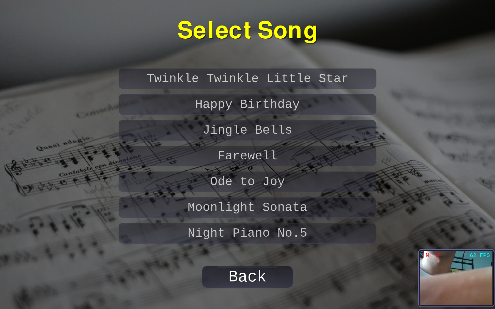
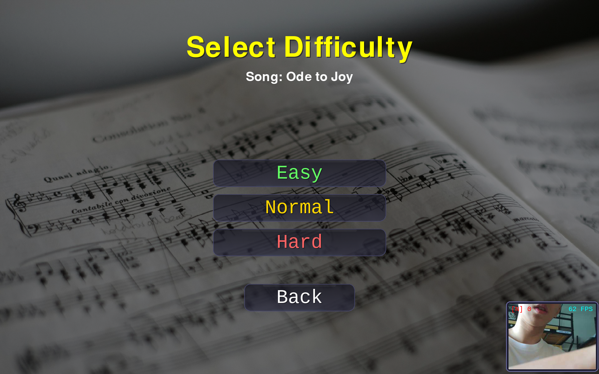

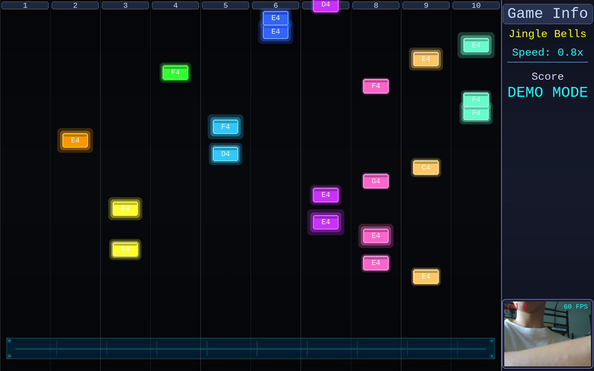
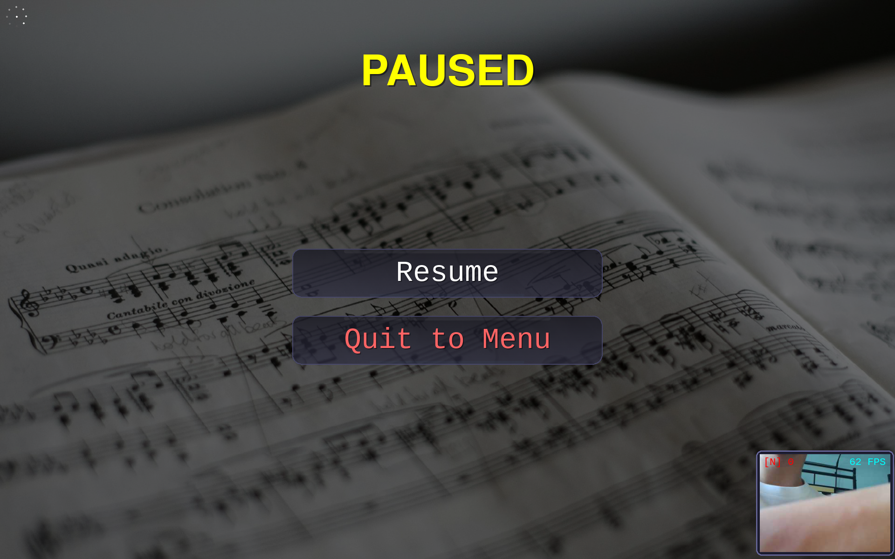

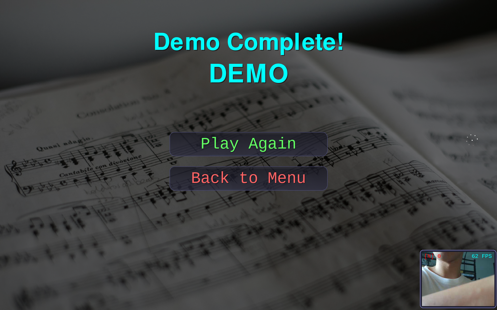

---

## 📁 目录结构

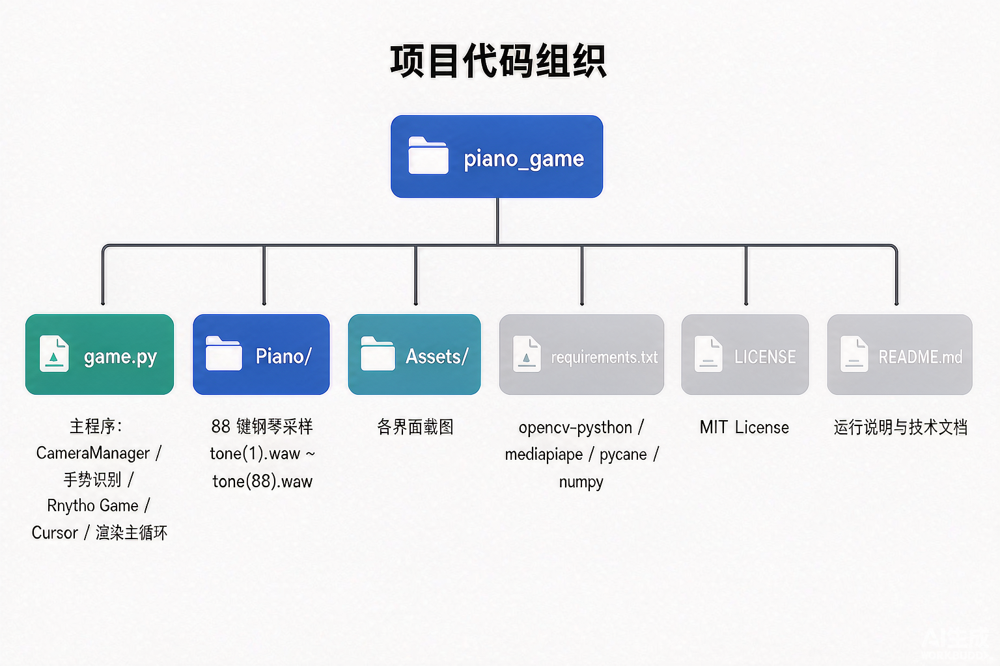

```
piano_game/
├── game.py                 # 主程序：手势识别 + 游戏逻辑 + 渲染
├── Piano/                  # 88 个钢琴采样 tone(1).wav ~ tone(88).wav（Git LFS）
├── Assets/                 # 游戏画面截图与流程图（README 用）
│   ├── Start_Menu.png
│   ├── Select_Song_Menu.png
│   ├── Select_Difficulty_Menu.png
│   ├── In_Game_Screen.png
│   ├── Pause_Menu.png
│   ├── Demo.png
│   ├── Demo_Completed_Menu.png
│   ├── Song_Completed_Menu.png
│   ├── bg_song.jpg               # 游戏背景图（仓库内，不联网加载）
│   ├── Joint_Structure.png
│   └── diagrams/           # 技术文档流程图
│       ├── gesture_pipeline.png        # 手势识别数据处理流水线
│       ├── game_state_flow.png         # 游戏状态流转图
│       ├── audio_pipeline.png            # 音频播放管线图解（采样→通道→扬声器）
│       ├── cache_perf_transparent.png    # 缓存与性能优化流程图（大字、抠图、立体感）
│       ├── rating_decision_tree.png    # 判定评级分支决策树
│       └── project_structure.png       # 项目目录结构
├── requirements.txt
├── .gitignore
└── README.md
```

---

## 💾 缓存与性能优化

程序用「**缓存 + 启动预载 + 资源池**」三类手段做性能优化，核心目标只有一个：**让演奏热路径（每帧）只做 O(1) 查找与轻量计算**，把昂贵的读盘、解码、重绘都前置到启动阶段或复用缓存，从而保证稳定帧率与音画同步。

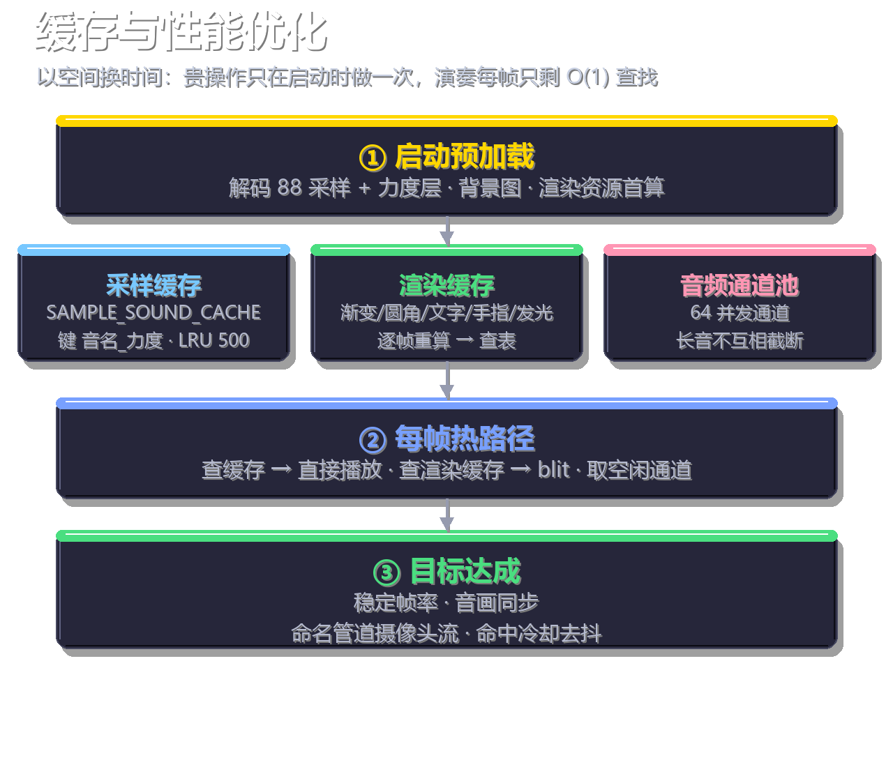

### 1. 背景图（仓库内 `Assets/bg_song.jpg`，不联网）

- 背景图 `Assets/bg_song.jpg`（1920×1280）**已提交进仓库**，**所有界面共用同一张**；运行时直接读取，不再联网下载，也不再生成 `bg_cache/` 缓存目录。
- 若该文件缺失，自动回退到暖色渐变背景（`create_fallback_bg`，见 `load_bg_images`），保证任何环境都能启动。

### 2. 运行时内存缓存（不落盘，进程退出即清空）

**(a) 音频采样缓存 `SAMPLE_SOUND_CACHE`**（定义 game.py:138；写入 `load_piano_sample` game.py:297）

把 `~/Piano` 下已解码的 `pygame.mixer.Sound` 对象按 **`音符名_力度`** 缓存（同一音名按力度 vel 4/8/12/16 分不同条目，对应真实钢琴不同触键力度采样），**上限 500 条**，超过则清掉最早一半（LRU）。查找命中即返回、未命中才读盘解码并写回：

```
get_note_sound(音名, 力度)
   └─ load_piano_sample()
        ├─ 命中 SAMPLE_SOUND_CACHE[音名_力度] ? → 直接返回 Sound（不读盘、不解码，微秒级）
        └─ 未命中 → 读盘 pygame.mixer.Sound() 解码 → 写入缓存 → 返回
```

找不到对应采样时自动回退到同音名其它八度 / `C4` / 第一个采样，保证首发也能出声并补入缓存。

**(b) 渲染结果缓存**（避免每帧重算）

- `BG_GRADIENT_CACHE` / `ROUNDED_RECT_CACHE` / `PRERENDERED_TEXTS` / `FINGER_STATE_CACHE` / `glow_cache` / `bar_fill_cache`：分别缓存渐变背景、圆角矩形、预渲染文字、手指状态、发光与进度条等高频渲染结果；
- `cached_game_bg` / `cached_game_bg_key`、`hitbox_cache` / `hitbox_cache_key`：按 key 复用整张游戏背景与命中框 Surface，避免每帧重绘。

这些缓存把「逐帧重算」变成「首次计算后查表」，是主循环稳定 60fps 的关键。

### 3. 启动预加载（以空间换时间）

- **采样预加载** `preload_all_samples`（game.py:1030）：启动 Loading 期间就把全部 88 采样 + 多力度层（vel 4/8/12/16）一次性解码进 `SAMPLE_SOUND_CACHE`。正式演奏阶段**几乎 100% 命中缓存、直接返回 Sound**，把「启动时的 Loading 等待」换成「运行时稳定帧率」。
- 渲染资源（渐变 / 圆角 / 预渲染文字等）也在首次使用前计算并缓存。
- **跨曲复用**：`SAMPLE_SOUND_CACHE` **不随切歌 / 重玩清空**（只有 `AudioManager.stop_all()` 清播放通道，不清缓存），整场只需付一次解码成本。

### 4. 资源池与节流

- **音频通道池（64 通道）**：`pygame.mixer.set_num_channels(64)`（game.py:39）+ `AudioManager`（game.py:145）。并发 64 个音不互相截断，免去动态分配/查找开销；全忙时抢占最老的音（最新优先）。
- **命名管道摄像头流**：树莓派上用 `rpicam-vid` 命名管道常驻流式读取帧（见「摄像头数据流」节），避免每次重新打开摄像头设备。
- **命中冷却（hit_cooldown = 3 帧）**：命中判定处（game.py:2706 等）对同一音符做去抖，避免被重复判定触发、从而重复解码/发声。

> 钢琴采样 **不** 缓存在仓库内，始终从 `~/Piano`（用户主目录下 `Piano/`）实时读取，并通过 `SAMPLE_SOUND_CACHE` 在内存中复用。

---

## 🎵 曲谱与 88 键音频的映射

### 1. 88 键采样如何对应到音符

`game.py` 将 88 个 wav 与标准音名一一绑定：`NOTE_NAMES_88` 从 **A0（MIDI 21）** 到 **C8（MIDI 108）** 排列，`tone(1).wav` ~ `tone(88).wav` 依次对应。通过 `NOTE_INDEX_LOOKUP` / `NOTE_TO_MIDI` 完成「音名（含 `Db`/`Eb` 等降号别名）↔ 索引 ↔ MIDI 编号」的三向查表，因此升降号音也能正确命中采样。

### 2. 曲谱中的简谱如何落到具体音

每首曲谱在 `PianoSheet.get_song()` 中以「简谱数字 + 八度符号」描述，例如 `'1'`、`'5'`、`'1''`（高八度）、`'6'`、`'7'`，并配一张 `scale_notes` 映射表把简谱数字翻译成带八度的真实音名：

| 曲谱 | 调性 | scale_notes 示例 | 说明 |
| --- | --- | --- | --- |
| Twinkle Twinkle | C | `1→C4, 2→D4 … 7→B4` | C 大调，中音区 |
| Happy Birthday | C | `5→G4 … 1'→C5 … 4'→F5` | 含高八度 |
| Jingle Bells | C | `1→C4 … 5→G4` | C 大调五音 |
| Farewell（送别） | C | `7̣→B3 … 1→C4 … 4'→F5` | 含低音 B3，音域 B3–F5 |
| Ode to Joy | C | `1→C4 … 7'→B5, 1''→C6` | 音域 C4–C6 |
| Moonlight Sonata | C#m | `3→E4, 5→G#4 … 3'→E5` | 升号调（含 G#/D#） |
| Night Piano No.5 | C | `1→C4 … b3'→Eb5 … b7''→Bb6` | 含降号（Eb/Bb），音域 C4–Bb6 |

游戏循环按 `notes` 列表（每个元素为 `(简谱数字, 时值)`）依次下落音符；当玩家命中时，先用 `parse_note_name_simple()` 把简谱数字解析为 `(音名, 八度)`，再经 `get_sample_file_for_note()` 映射到 `tone(n).wav` 并播放，从而实现「简谱 → 真实钢琴采样」的闭环。

### 3. 曲谱来源

> 游戏内置曲谱（Twinkle Twinkle / Happy Birthday / Jingle Bells / Farewell / Ode to Joy / Moonlight Sonata / Night Piano No.5 等）均由作者根据**网络上的乐曲简谱**人工整理、转换为上述简谱数字格式而来，仅用于演示与学习，版权归原曲作者所有。

---

## 🚧 目前存在的问题

- 背景可改为**动态背景**（如流动渐变、粒子）替代当前静态/单图背景。
- 不同按键生效时可播放**不同的音效**（如确认/返回/选曲提示音），提升交互反馈。

---

## 📄 License

本项目以 MIT License 开源，详见 [LICENSE](LICENSE)。

钢琴采样来源：[open-source-toolkit/870f3](https://gitcode.com/open-source-toolkit/870f3.git)，版权归原作者所有，仅用于学习与非商业用途。
