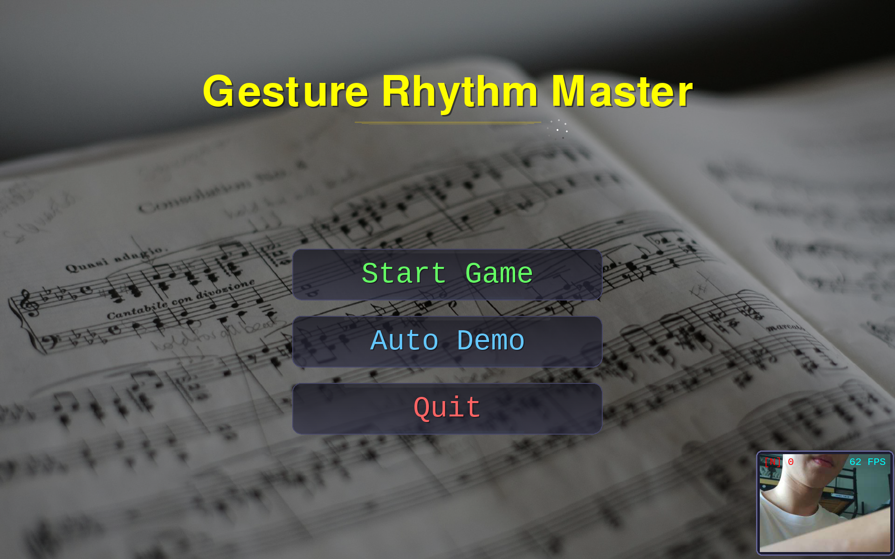
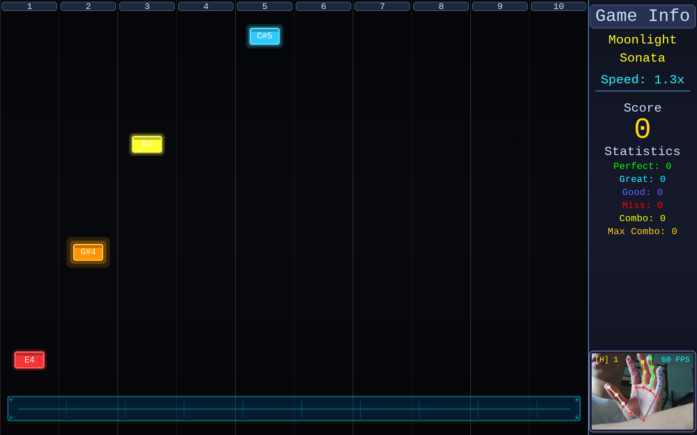
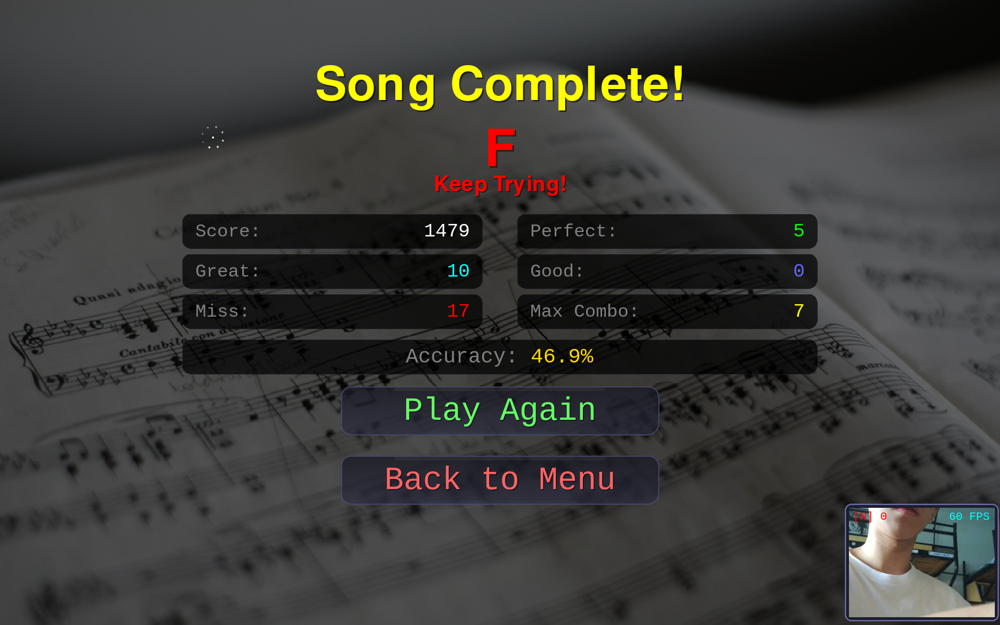

# 🎹 手势钢琴 · Gesture Piano

一个基于 **MediaPipe Hands** 的实时手势识别钢琴节奏游戏。玩家无需任何实体键盘——只需在摄像头前用**双手十指**对准屏幕上下落的音符，在正确的时机**弯曲对应手指**即可"弹奏"；在菜单中**移动手掌**控制光标、**握拳**完成点击。

> 项目原名 *Gesture Rhythm Master - Piano Mode*，使用 88 键真实钢琴采样（`Piano/` 目录）进行声音合成，并支持升/降号映射。

---

## ✨ 特性

- 🖐️ **纯视觉手势操控**：双手 10 指分别对应 10 条轨道，零接触游玩。
- 🎯 **三种手势语义**：光标移动（手部中心）、菜单点击（握拳）、音符命中（手指弯曲 / 点击）。
- 🎵 **真实钢琴音色**：88 个 `tone(N).wav` 单声道采样，按音名动态加载与音高映射。
- 📈 **节奏判定**：PERFECT / GREAT / GOOD / MISS 四级评分，含连击（combo）与准确率统计。
- 🎚️ **三档难度**：Easy / Normal / Hard 对应不同音符下落速度。
- 🖥️ **全屏 + 侧边栏**：左侧游戏区、右侧实时摄像头预览与游戏信息。
- 🤖 **演示模式**：无手势时自动演奏，便于展示与调试。

---

## 🔧 硬件配置

本项目在 **Raspberry Pi 5** 上验证通过，但架构也适用于任意带摄像头的 Linux/macOS/Windows 机器。

| 部件 | 说明 |
| --- | --- |
| 主机 | Raspberry Pi 5（4GB 内存，32GB SD 卡），运行 **Ubuntu 24.04 (arm64)** |
| 摄像头 | Raspberry Pi Camera Module 3（CSI 接口），由 `rpicam-vid`(libcamera) 输出 MJPEG 流 |
| 显示 | 1920×1200 HDMI 显示器（程序以当前桌面分辨率**全屏**运行） |
| 音频 | USB 音响，`pygame.mixer` 播放采样 |
| 键盘 | USB 键盘，仅用于 `ESC` 退出、`SPACE` 暂停、`Q` 退出 |

### 摄像头数据流（命名管道）

游戏**不**直接调用 `cv2.VideoCapture(0)`，而是由 `CameraManager` 启动 `rpicam-vid` 把 MJPEG 流写入一个命名管道 `/tmp/camera_pipe`，再由 OpenCV 以 `CAP_FFMPEG` 读取。这样可绕开树莓派上 `libcamera` 与 OpenCV 直接采集的兼容问题：

```651:690:game.py
class CameraManager:
    def __init__(self, fps=90):
        ...
        self.pipe_path = '/tmp/camera_pipe'
        ...
        os.mkfifo(self.pipe_path)
        cmd = [
            'rpicam-vid',
            '-t', '0',
            '--width', '320',
            '--height', '240',
            '--framerate', str(fps),
            '--codec', 'mjpeg',
            '--nopreview',
            '--output', self.pipe_path
        ]
```

**摄像头采集规格**：`rpicam-vid` 以 **320×240** 分辨率、**最高 90 FPS**（MJPEG）采集，写入命名管道；OpenCV 以 `CAP_FFMPEG` 读取后，镜像并缩放为 **280×210** 的预览窗口绘制到界面右下角。实际可达帧率取决于 Pi 5 的负载（手势推理 + 渲染），程序会在预览窗口角落实时显示当前 `camera_fps`。

> 若使用普通 USB/内置摄像头，可将 `CameraManager` 改为 `cv2.VideoCapture(0)`（并删除 `rpicam-vid` 相关逻辑），其余手势流水线完全复用。

---

## 📦 环境依赖

**系统层**（Ubuntu 24.04 arm64）：

```bash
sudo apt update
sudo apt install -y python3 python3-pip rpicam-apps   # rpicam-apps 提供 rpicam-vid
```

**Python 依赖**（见 `requirements.txt`）：

```bash
pip3 install -r requirements.txt
```

| 依赖 | 用途 |
| --- | --- |
| `opencv-python` | 摄像头帧读取、BGR↔RGB 转换、镜像、绘制关键点 |
| `mediapipe` | `solutions.hands` 提供 21 点手部关键点模型 |
| `pygame` | 游戏渲染、事件循环、音频混音 |
| `numpy` | 坐标计算与数值处理 |

> 程序会设置 `MEDIAPIPE_DISABLE_GPU=1` 与 `TF_CPP_MIN_LOG_LEVEL=3`，强制 MediaPipe 在 **CPU** 上运行并抑制日志，适合树莓派等无独显环境。

---

## 🤚 手势识别实现（核心）

这是本项目的重点。整套识别链路可概括为：

```
摄像头帧 ──► [镜像 flip] ──► [BGR→RGB]
        ──► MediaPipe Hands ──► 21 关键点 (归一化 0~1)
        ──► ① 手部中心 → 屏幕光标
        ──► ② 每指伸展状态 → 握拳判定 → 菜单点击
        ──► ③ 手指"伸展→弯曲"跳变 → 对应轨道音符命中
```

### 1. 手部关键点检测（MediaPipe Hands）

初始化一个可检测**双手**的轻量模型（`model_complexity=0` 保证树莓派上的实时性）：

```784:790:game.py
hands = mp_hands.Hands(
    static_image_mode=False,
    max_num_hands=2,
    model_complexity=0,
    min_detection_confidence=0.5,
    min_tracking_confidence=0.3
)
```

在游戏主循环中，每帧把镜像后的 RGB 帧送入模型，得到每只手的 21 个归一化关键点 `hand_landmarks` 与左右手标签 `handedness`：

```2963:2976:game.py
if frame is not None and camera_available:
    frame = cv2.flip(frame, 1)
    camera_fps = camera.get_fps()
    rgb_frame = cv2.cvtColor(frame, cv2.COLOR_BGR2RGB)
    results = hands.process(rgb_frame)

    if results.multi_hand_landmarks:
        hand_detected = True
        hand_count = len(results.multi_hand_landmarks)
        for idx, (hand_landmarks, handedness) in enumerate(
                zip(results.multi_hand_landmarks, results.multi_handedness)):
            is_left = handedness.classification[0].label == 'Left'
            finger_states = get_finger_states(hand_landmarks, is_left)
```

关键点索引约定（MediaPipe Hands）：

- `0` 手腕；`1/5/9/13/17` 五指掌指关节（MCP）；`2/6/10/14/18` PIP；`3/7/11/15/19` PIP→DIP；`4/8/12/16/20` 指尖。
- 拇指用 `3`↔`4` 的 **x** 方向判断；其余手指用指尖与 PIP 的 **y** 方向判断。

### 2. 镜像与坐标归一化

摄像头帧先做水平镜像 `cv2.flip(frame, 1)`，形成"照镜子"的自然交互；MediaPipe 输出的关键点坐标为相对图像的归一化值 `[0,1]`，后续用于光标与手势判定时再按屏幕分辨率放大。

### 3. 手势 ①：手部中心 → 屏幕光标

取手掌区域的 5 个参考点（手腕 + 四个 MCP）求平均，作为"手部中心"：

```831:835:game.py
def get_hand_center(hand_landmarks):
    lm = hand_landmarks.landmark
    x = (lm[0].x + lm[5].x + lm[9].x + lm[13].x + lm[17].x) / 5
    y = (lm[0].y + lm[5].y + lm[9].y + lm[13].y + lm[17].y) / 5
    return x, y
```

将中心相对屏幕中心的偏移量归一化到 `[-1,1]`，再乘以灵敏度系数 `MOUSE_SCALE=5.0` 映射到全屏坐标，并做**指数平滑**（每帧 `mouse = mouse*0.8 + target*0.2`）消除抖动：

```2979:2999:game.py
if idx == 0:
    hx, hy = get_hand_center(hand_landmarks)
    center_x = 0.5; center_y = 0.5
    offset_x = (hx - center_x) * 2   # [-1, 1]
    offset_y = (hy - center_y) * 2
    screen_x = SCREEN_WIDTH // 2 + offset_x * SCREEN_WIDTH * MOUSE_SCALE / 2
    screen_y = SCREEN_HEIGHT // 2 + offset_y * SCREEN_HEIGHT * MOUSE_SCALE / 2
    screen_x = max(margin, min(SCREEN_WIDTH - margin, screen_x))
    screen_y = max(margin, min(SCREEN_HEIGHT - margin, screen_y))
    mouse_x = mouse_x * (1 - 0.2) + screen_x * 0.2   # 低通平滑
    mouse_y = mouse_y * (1 - 0.2) + screen_y * 0.2
```

> `MOUSE_SCALE=5.0` 意味着手掌只需在画面内移动约 **1/5** 范围即可横扫整屏，适合站立远距离游玩；可按手感下调。

### 4. 每根手指的伸展状态

`get_finger_states` 用几何阈值给出每根手指是否"伸展"（布尔值）。由于做了镜像，判定时需注意左右手的 x 方向符号相反：

```801:823:game.py
def get_finger_states(hand_landmarks, is_left_hand):
    lm = hand_landmarks.landmark
    ...
    if is_left_hand:
        finger_states['left_thumb']  = lm[4].x  > lm[3].x
        finger_states['left_index']  = lm[8].y  < lm[6].y
        finger_states['left_middle'] = lm[12].y < lm[10].y
        finger_states['left_ring']   = lm[16].y < lm[14].y
        finger_states['left_pinky']  = lm[20].y < lm[18].y
    else:
        finger_states['right_thumb']  = lm[4].x  < lm[3].x
        finger_states['right_index']  = lm[8].y  < lm[6].y
        finger_states['right_middle'] = lm[12].y < lm[10].y
        finger_states['right_ring']   = lm[16].y < lm[14].y
        finger_states['right_pinky']  = lm[20].y < lm[18].y
```

要点：非拇指手指"向上伸"时指尖 `y` 小于 PIP 的 `y`（图像坐标系 y 轴向下）；拇指用左右向 `x` 判断开合。

### 5. 手势 ②：握拳 → 菜单点击（带迟滞去抖）

当一只手中**伸展的手指数 ≤ 1** 时判定为"握拳"，用作点击：

```837:843:game.py
def is_fist(finger_states, is_left):
    if is_left:
        fingers = ['left_thumb', 'left_index', 'left_middle', 'left_ring', 'left_pinky']
    else:
        fingers = ['right_thumb', 'right_index', 'right_middle', 'right_ring', 'right_pinky']
    extended_count = sum(1 for f in fingers if finger_states.get(f, False))
    return extended_count <= 1
```

为避免单帧抖动导致误触，主循环对握拳做了**迟滞（hysteresis）**：连续 ≥ `FIST_THRESHOLD=3` 帧都判定为握拳才置位 `is_fisting`，一旦张开立即清零：

```3001:3007:game.py
if is_fist(finger_states, is_left):
    fist_timer += 1
    if fist_timer >= FIST_THRESHOLD:
        is_fisting = True
else:
    fist_timer = 0
    is_fisting = False
```

随后交给 `Cursor` 对象，并叠加 **8 帧点击冷却**（`is_click_active()`），鼠标移动与点击状态被送入菜单系统完成"悬停+点选"。

### 6. 手势 ③：手指弯曲 → 音符命中

游戏有 **10 条轨道**，每条轨道固定对应一根手指（左右手各 5 指）。映射表如下（左侧 1–5、右侧 6–10）：

```792:797:game.py
FINGER_MAP = {
    'left_pinky': 1, 'left_ring': 2, 'left_middle': 3,
    'left_index': 4, 'left_thumb': 5,
    'right_thumb': 6, 'right_index': 7,
    'right_middle': 8, 'right_ring': 9, 'right_pinky': 10
}
```

"弹奏"动作被建模为**手指由伸展变为弯曲的跳变**（一次"点击"）。每帧对比当前与上一帧的伸展状态，凡是"上一帧伸、这一帧弯"的手指即视为被按下，转换为对应的轨道编号：

```2315:2329:game.py
pressed_fingers = []
if finger_states is not None:
    for finger_name, is_extended in finger_states.items():
        prev_state = self.prev_finger_states.get(finger_name, False)
        if prev_state and not is_extended:
            pressed_fingers.append(finger_name)
    self.prev_finger_states = finger_states.copy()

pressed_numbers = []
for finger_name in pressed_fingers:
    if finger_name in FINGER_MAP:
        pressed_numbers.append(FINGER_MAP[finger_name])

active_fingers = pressed_numbers
```

> 因此游玩时：**当某个音符滑入屏幕底部的判定线（hit line）时，快速弯曲对应手指**即可触发该音符。连续弯曲同一手指可连击不同音符。

### 7. 命中判定与评级

音符持续下落，当它的底边进入判定带 `[hit_line, hit_line + hit_zone_height]` 且对应轨道手指被按下时，按音符中心与判定带中心的偏差评级：

```2365:2393:game.py
for note in self.notes:
    note.update()
    if not note.hit and not note.miss:
        note_bottom = note.y + note.height
        if hit_zone_top <= note_bottom <= hit_zone_bottom:
            if self.is_demo or note.lane in active_fingers:
                center_y = note.y + note.height / 2
                distance = abs(center_y - hit_center)
                if self.is_demo:
                    ...   # 演示模式自动 PERFECT
                elif distance < PERFECT_THRESHOLD:   # 10px
                    self.score += 100 + self.combo * 5
                    ...   # PERFECT!
                elif distance < GREAT_THRESHOLD:     # 22px
                    self.score += 70 + self.combo * 3
                    ...   # GREAT!
                elif distance < GOOD_THRESHOLD:      # 35px
                    self.score += 50 + self.combo * 2
                    ...   # GOOD
```

阈值：`PERFECT < 10px`、`GREAT < 22px`、`GOOD < 35px`；音符越过屏幕底部仍未命中则计 `MISS` 并清空连击。判定线位置 `hit_line = height - 90`、判定带高度 `hit_zone_height = 35`。

### 8. 鲁棒性处理小结

- **CPU 推理**：`MEDIAPIPE_DISABLE_GPU=1`，适配无 GPU 设备。
- **指数平滑**：光标坐标低通滤波，抑制关键点抖动。
- **迟滞去抖 + 冷却**：握拳需连续 3 帧、点击后 8 帧冷却，杜绝误触。
- **缺手暂停**：非演示模式下若连续多帧未检测到手，自动暂停并提示，避免"幽灵操作"。
- **结果缓存**：`get_finger_states` 对相同关键点做 `FINGER_STATE_CACHE` 缓存，降低重复计算。
- **调试叠加**：检测到手时在预览画面用 `mp_drawing` 画出 21 点骨架，便于校准。

---

## 🎮 游戏逻辑设计

```
开始菜单 ──► 选择曲目 ──► 选择难度 ──► 游戏中(下落式钢琴) ──► 结算界面
```

- **曲目**：内置 `Twinkle Twinkle`、`Happy Birthday`、`Jingle Bells`，每首以 `(音名, 时值)` 序列定义于 `PianoSheet`。
- **难度**：`Easy=0.5×` / `Normal=0.8×` / `Hard=1.3×` 控制音符下落速度与生成节奏（`speed_multiplier`）。
- **轨道生成**：每个音符随机分配到 1–10 号轨道，再按曲目的 `scale_notes` 把简谱音名映射到真实音高（如 `C4`/`D5`）。
- **音频**：`get_note_sound()` 按音名在 `Piano/` 采样目录中查找对应 `tone(N).wav`，找不到时自动回退到同音名其它八度或 `C4`，并以缓存避免重复加载。
- **计分**：`score`（含连击加成）、`combo` / `max_combo`、`perfect/good/miss` 计数、`accuracy` 准确率，结算界面展示评级（详见下方「🏆 计分与评级」章节）。
- **暂停/退出**：`SPACE` 或握拳暂停；`ESC` 逐级退出；`Q` 直接退出。

---

## 🏆 计分与评级

### 1. 命中判定与单次得分

当音符底边进入判定带 `[hit_line, hit_line + hit_zone_height]`（判定带高 35px，判定线 `hit_line = 屏幕高度 - 90`）且对应轨道手指被按下时，按**音符中心与判定带中心的像素距离 `distance`** 评级并结算分数：

| 评级 | 距离阈值 | 基础分 | 连击加成 | 提示色 |
| --- | --- | --- | --- | --- |
| PERFECT! | `distance < 10px` | 100 | `+ combo × 5` | 绿 |
| GREAT! | `distance < 22px` | 70 | `+ combo × 3` | 青 |
| GOOD | `distance < 35px` | 50 | `+ combo × 2` | 蓝 |
| MISS | 音符越过屏幕底部仍未被命中 | 0 | 连击清零 | 红 |

单次得分 = **基础分 + 当前连击数 × 系数**。例如当前连击为 20 时打出 PERFECT，本次得分 = 100 + 20×5 = 200。连击越高，单次收益越高，是冲分的关键。

> 判定阈值与命中机制详见上文「手势识别实现 → 7. 命中判定与评级」。

### 2. 连击（Combo）

- 每成功命中一个音符，`combo` 加 1，并记录本局 `max_combo`（最高连击）。
- 出现 **MISS**（音符漏掉 / 越过屏幕底部）时 `combo` 立即归零。
- 连击数直接参与得分公式的加成项，因此保持长连击能放大总分。

### 3. 准确率（Accuracy）

```text
total_notes  = perfect_count + good_count + miss_count
accuracy     = (perfect_count + good_count) / total_notes × 100%
```

其中 `good_count` 同时计入 **GREAT** 与 **GOOD**（二者在统计上合并为 "Good"），MISS 不计入命中。

### 4. 结算评级（Rating）

曲目结束（或演示结束）调用 `calculate_rating()`，依据 **漏失率 `miss_rate`** 与 **PERFECT 率 `perfect_rate`** 给出最终评级：

```text
miss_rate    = miss_count    / total_notes
perfect_rate = perfect_count / total_notes
```

| 评级 | 条件 | 含义 |
| --- | --- | --- |
| **SSS+** | `miss_rate == 0` 且 `perfect_rate ≥ 0.95` | Perfect Full Combo! |
| **SSS** | `miss_rate == 0` 且 `perfect_rate ≥ 0.85` | Excellent Full Combo! |
| **SS** | `miss_rate == 0` 且 `perfect_rate ≥ 0.70` | Great Full Combo! |
| **S** | `miss_rate == 0`（其余） | Good Full Combo! |
| **S+** | `miss_rate ≤ 0.02` | Almost Perfect! |
| **S** | `miss_rate ≤ 0.05` | Excellent! |
| **A** | `miss_rate ≤ 0.10` | Great! |
| **B** | `miss_rate ≤ 0.15` | Good! |
| **C** | `miss_rate ≤ 0.25` | Fair |
| **D** | `miss_rate ≤ 0.40` | Needs Practice |
| **F** | `miss_rate > 0.40` | Keep Trying! |
| *No Data* | 本局无任何音符 | No notes played |

> 规则要点：**全连击（无 MISS）**时按 PERFECT 率细分（SSS+ / SSS / SS / S）；一旦漏失，仅按漏失率由高到低评级（S+ → F）。结算界面（`Assets/Song_Completed_Menu.png`）会同时展示分数、最大连击、`Perfect/Good/Miss` 计数、准确率与评级。

---

## 🖼️ 游戏画面设计

游戏为**全屏**布局。整个游玩过程中（菜单、选曲、演奏、暂停、结算）**摄像头画面始终显示**在界面右下角的预览窗口（含 21 点手部骨架叠加，便于校准）。

**侧边栏仅在曲目演奏时显示**：右侧 300px 侧边栏（`Assets/In_Game_Screen.png`）只在 `in_game` 且未进入结算界面时出现，用于展示曲目名、速度、分数、Perfect/Good/Miss 计数与连击等信息；在菜单、选曲、暂停、结算等其它界面，侧边栏不绘制，仅保留右下角的摄像头预览。

左侧游玩区包含 10 条发光轨道 + 下落音符 + 命中特效/粒子。

| 画面 | 文件 | 说明 |
| --- | --- | --- |
| 开始菜单 | `Assets/Start_Menu.png` | 标题与"开始/演示"等入口，光标跟随手掌移动 |
| 选曲菜单 | `Assets/Select_Song_Menu.png` | 曲目列表，握拳点选 |
| 难度菜单 | `Assets/Select_Difficulty_Menu.png` | Easy / Normal / Hard |
| 游戏中 | `Assets/In_Game_Screen.png` | 下落音符 + 轨道高亮 + 侧边栏摄像头预览 |
| 暂停菜单 | `Assets/Pause_Menu.png` | 暂停时叠加的菜单 |
| 演示模式 | `Assets/Demo.png` | 无手势自动演奏展示 |
| 结算界面 | `Assets/Song_Completed_Menu.png` | 分数、最大连击、准确率与评级 |





---

## 🚀 如何启动

### 方式 A：树莓派（CSI 摄像头 + rpicam-vid）

```bash
# 1. 安装系统依赖
sudo apt update && sudo apt install -y python3 python3-pip rpicam-apps

# 2. 安装 Python 依赖
pip3 install -r requirements.txt

# 3. 准备钢琴采样（项目已附带，软链或复制到 ~/Piano）
mkdir -p ~/Piano
cp -r Piano/* ~/Piano/        # 程序默认从 ~/Piano 读取 tone(N).wav

# 4. 运行（确保摄像头已连接并在 raspi-config 中启用）
python3 game.py
```

### 方式 B：普通电脑（USB/内置摄像头）

将 `game.py` 中的 `CameraManager` 改为使用 `cv2.VideoCapture(0)`，并将采样放入 `~/Piano`，其余步骤相同：

```python
# 替换 CameraManager 的初始化逻辑为：
self.cap = cv2.VideoCapture(0, cv2.CAP_ANY)
```

### 运行中的操作

| 操作 | 手势 / 按键 |
| --- | --- |
| 移动菜单光标 | 手掌左右/上下移动 |
| 确认 / 点击 | 握拳（保持约 3 帧） |
| 弹奏音符 | 音符到判定线时弯曲对应手指 |
| 暂停 | `SPACE` 或握拳 |
| 退出当前界面 | `ESC` |
| 退出程序 | `Q` |

---

## 📁 目录结构

```
piano_game/
├── game.py                 # 主程序：手势识别 + 游戏逻辑 + 渲染
├── Piano/                  # 88 个钢琴采样 tone(1).wav ~ tone(88).wav
├── Assets/                 # 游戏画面截图（README 用）
│   ├── Start_Menu.png
│   ├── Select_Song_Menu.png
│   ├── Select_Difficulty_Menu.png
│   ├── In_Game_Screen.png
│   ├── Pause_Menu.png
│   ├── Demo.png
│   └── Song_Completed_Menu.png
├── requirements.txt
├── .gitignore
└── README.md
```

---

## 🛠️ 常见问题

- **找不到摄像头 / 无画面**：确认 `rpicam-vid` 可用且摄像头已在 `raspi-config` 启用；或改用 `cv2.VideoCapture(0)`。
- **手势误触/不灵敏**：调整 `MOUSE_SCALE`（光标灵敏度）、`FIST_THRESHOLD`（握拳确认帧数）、`PERFECT/GREAT/GOOD_THRESHOLD`（判定宽松度）。
- **无声**：确认音频设备正常，`pygame.mixer` 已初始化；检查 `~/Piano` 下采样文件存在。
- **帧率偏低**：`model_complexity=0` 已是轻量模型；可下调摄像头分辨率或减少 `max_num_hands`。

---

## 📄 License

本项目以 MIT License 开源，详见 [LICENSE](LICENSE)。

钢琴采样来源：[open-source-toolkit/870f3](https://gitcode.com/open-source-toolkit/870f3.git)，版权归原作者所有，仅用于学习与非商业用途。
